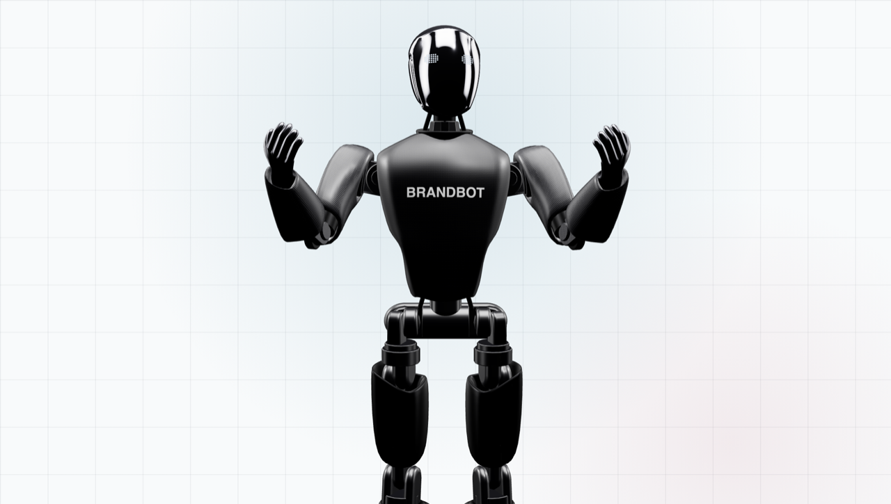

# BrandBot 🤖

**A 3D robot mascot you brand with your own logo and colors.** A drop-in React component that gestures, blinks, and follows the visitor's cursor. It renders with [Three.js](https://threejs.org), is written in TypeScript with full type declarations, and bundles the model — so there's nothing to configure or host. Works in any React app (see the Next.js note below).

**[▶ Live demo](https://aidan945.github.io/brandbot/demo/)** · **[Configure & copy code](https://aidan945.github.io/brandbot/demo/configure.html)**



## Install

```bash
npm install brandbot three react
```

## Use

```jsx
import { BrandBot } from 'brandbot';

export function Hero() {
  return (
    <div style={{ height: 600 }}>
      <BrandBot primary="#13294b" eyes="#7fd4ff" logoText="ACME" />
    </div>
  );
}
```

That's it. The component fills its parent, renders on a transparent background, and starts moving. **The default needs no extra CSS** — drop it in a sized box and it looks right.

### Full-bleed hero (optional)

To have the robot rise from the bottom of a full-height hero with its legs fading into the page (like the [demo](https://aidan945.github.io/brandbot/demo/)), wrap it:

```jsx
<div style={{ height: '100vh', overflow: 'hidden',
              WebkitMaskImage: 'linear-gradient(180deg,#000 88%,transparent 100%)' }}>
  <div style={{ position: 'absolute', inset: 0,
                transform: 'scale(1.1) translateY(8%)', transformOrigin: 'center top' }}>
    <BrandBot />
  </div>
</div>
```

**By default it stays put** — locked in its box, facing forward, following the cursor. It does *not* let visitors drag-rotate it (rarely what you want in a hero or card). Add `orbit` to enable drag-to-rotate for demos.

## Brand it

Every color and the chest logo is a prop. Drop in your logo as text, an uploaded image (inlined as base64), or a URL:

```jsx
<BrandBot
  primary="#0e1a2b"
  accent="#1d3350"
  eyes="#7fd4ff"
  logoImage="/logo.png"   // or logoText="ACME"
/>
```

The **[configurator](https://aidan945.github.io/brandbot/demo/configure.html)** lets you tweak everything visually and copies the exact JSX for your setup.

## Props

| Prop | Type | Default | |
|---|---|---|---|
| `primary` | color | near-black | body shell + carbon parts |
| `accent` | color | dark metal | joints, mechanical internals |
| `visor` | color | chrome | face plate |
| `hands` | color | chrome | hands |
| `eyes` | color | white-blue | LED dot-matrix eyes |
| `logoText` | string | — | text logo on the chest (1–3 words) |
| `logoColor` | color | white | |
| `logoImage` | url | — | image logo (transparent PNG/SVG best); overrides text |
| `legs` | boolean | `true` | `false` shows the upper body only |
| `orbit` | boolean | `false` | `true` lets visitors drag to rotate (for demos) |
| `intro` | boolean | `true` | one-time zoom-in when the model loads |
| `trackPointer` | `'window' \| 'element' \| false` | `'window'` | what the head watches |
| `shadow` | boolean | `true` | soft ground shadow |
| `modelUrl` | url | bundled | load a different glTF instead of the bundled model |
| `className`, `style` | | | passed to the wrapper div |

All color/logo/legs props are live — update them in state and the robot changes instantly. (`orbit` and `intro` are set once at mount.)

Imperative handle via ref:

```jsx
const bot = useRef(null);
<BrandBot ref={bot} />
<button onClick={() => bot.current.spin()}>Spin</button>     {/* one full turn   */}
<button onClick={() => bot.current.replay()}>Replay</button> {/* the zoom-in intro */}
```

## Next.js

WebGL can't server-render, so load it client-side:

```jsx
import dynamic from 'next/dynamic';
const BrandBot = dynamic(() => import('brandbot').then(m => m.BrandBot), { ssr: false });
```

## Without React

The engine is framework-agnostic:

```js
import { createBrandbot } from 'brandbot/core';
import model from 'brandbot/model';

const robot = createBrandbot(document.querySelector('#hero'), { gltf: model });
robot.set({ primary: '#13294b', logoText: 'ACME' });
```

## Demo

The `demo/` folder is a no-build static site (works on GitHub Pages):

- **`demo/index.html`** — showcase: the robot rising from a light-grid hero with the zoom-in intro and cursor tracking.
- **`demo/configure.html`** — live configurator with tabbed code, "copy code", and "copy prompt for agent".

Run `python3 -m http.server` in the package folder and open `demo/index.html`.

## Development

```bash
npm install      # toolchain (typescript, @types/three, @types/react)
npm run build    # compile src/*.ts → dist/ (+ .d.ts) and copy the model
npm run typecheck
```

Source lives in `src/` (TypeScript). The committed `dist/` is what the demo and
npm package consume; rebuild it after changing `src/`.

## License

- **Code:** MIT.
- **Model:** the bundled robot is the [NEXBOT character](https://community.spline.design/file/87343305-102d-4670-bb8e-38252064de27), a Spline Community file under [CC0 1.0](https://creativecommons.org/publicdomain/zero/1.0/) (public domain). Per [Spline's docs](https://docs.spline.design/doc/community-platform/docSaqY7mlFz): "All the community files are licensed under CC0 1.0 Universal Deed." Free to use, modify, and redistribute — including commercially — with no attribution required. Credited anyway, because it's a great model.
